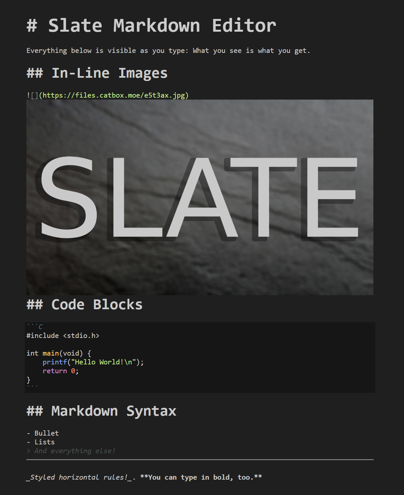

# Slate Markdown Editor

## Project Overview

This is a highly customized, lightweight Markdown editor built on EasyMDE (which uses CodeMirror 5).

The core philosophy of this project is to achieve a seamless WYSIWYG markdown editing experience in VSCode without the clunkiness of many full-fledged editors. The project is heavily inspired by the likes of Typora and Obsidian.md. 

## Showcase

## Built With

EasyMDE: The base Markdown editor library.

CodeMirror 5: The underlying text editor engine.

## For Developers

1. `git clone https://github.com/archiebhl/slate-markdown.git`
2. `cd slate-markdown`
3. `pnpm install`
4. `pnpm run compile`
5. Run with your method of choice. On VSCode, Press `F5` and run the extension for testing. 